<picture>
  <source media="(prefers-color-scheme: dark)" srcset="assets/hero-dark.jpg">
  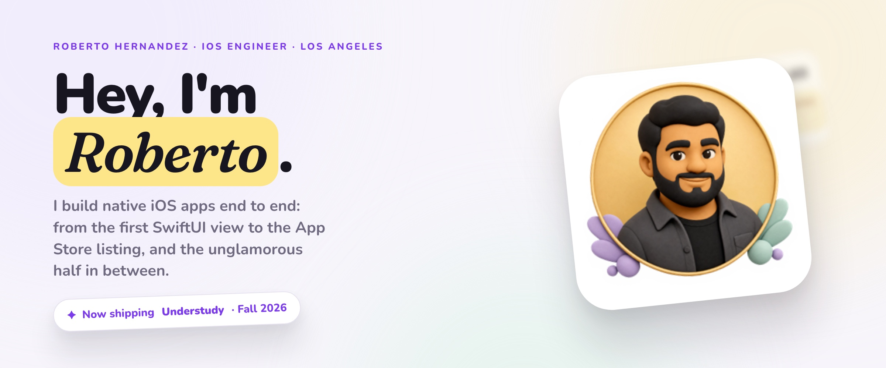
</picture>

<p align="center">
  <a href="https://www.robertoefrainhernandez.com"><picture><source media="(prefers-color-scheme: dark)" srcset="assets/link-portfolio-dark.png">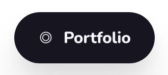</picture></a>
  <a href="https://www.linkedin.com/in/robertoefrainhernandez"><picture><source media="(prefers-color-scheme: dark)" srcset="assets/link-linkedin-dark.png">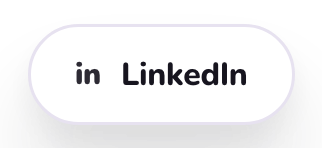</picture></a>
  <a href="https://twitter.com/PreachOnBerto"><picture><source media="(prefers-color-scheme: dark)" srcset="assets/link-x-dark.png">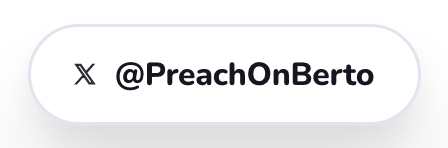</picture></a>
  <a href="mailto:reh9019@gmail.com"><picture><source media="(prefers-color-scheme: dark)" srcset="assets/link-email-dark.png"></picture></a>
</p>

<br>

<picture>
  <source media="(prefers-color-scheme: dark)" srcset="assets/section-now-dark.png">
  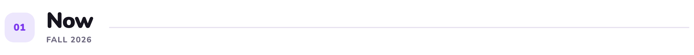
</picture>

<a href="https://bertolabs.com/understudy">
<picture>
  <source media="(prefers-color-scheme: dark)" srcset="assets/understudy-dark.jpg">
  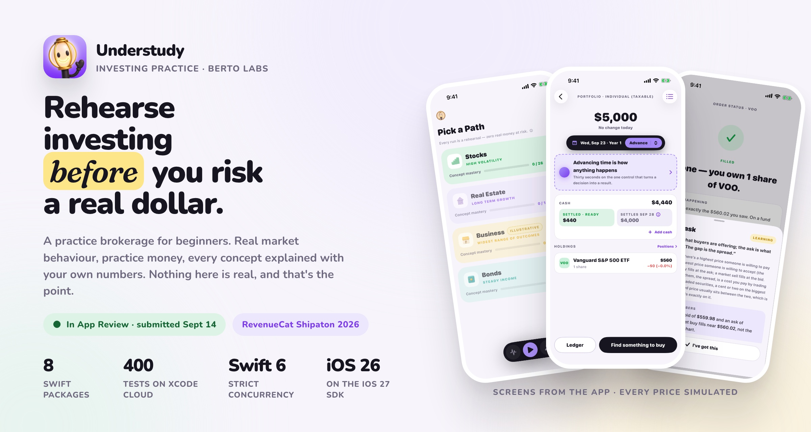
</picture>
</a>

<!-- When 1.0 is live: swap the link above for the App Store URL and add the button:
<p align="center"><a href="APP_STORE_URL"><picture><source media="(prefers-color-scheme: dark)" srcset="assets/link-appstore-dark.png">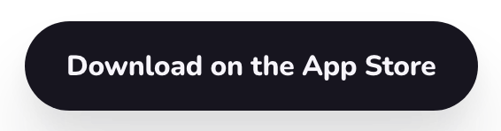</picture></a></p>
-->

**Understudy** is my first app as **Berto Labs**, built for the RevenueCat Shipaton 2026 and submitted to the App Store on September 14. It's a practice brokerage: real market behaviour, practice money, nothing at risk. You rehearse the decisions (buy, hold, sell, panic, don't) before you make them with real dollars. The app is the résumé, so here is what's inside it.

| | Understudy, by the numbers |
|:--|:--|
| **Architecture** | 8 local Swift packages as vertical slices. Each has a `Domain` target (entities, repositories, use cases, no SwiftUI) and a `Feature` target (views and `@Observable` view models). Features never import each other; cross-feature navigation is wired once, at the composition root. |
| **Language** | Swift 6 with strict concurrency. `@MainActor` view models, an actor-isolated simulation engine, structured cancellation. iOS 26 deployment against the iOS 27 SDK, new APIs gated behind `#available`. |
| **Persistence** | Offline first. One SQLite database (SQLiteData over GRDB) behind a single actor; every `Domain` contributes its own migrations through a `SchemaContributing` protocol and the root assembles them into one ordered list. In-progress rehearsals live here, so a session runs with no network. What deserves to outlive the device (financial profile, learning progress, session summaries) syncs to Supabase Postgres through a `RemoteSyncable` protocol that mirrors the local one. Preferences sit in a thin `UserDefaults` wrapper. No Keychain, on purpose: nothing in the app is worth one. |
| **Backend** | Supabase. Silent anonymous sign-in on first launch, optional Apple or Google linking later, row-level security on every user table, account deletion through an edge function that checks the caller's token. |
| **Tests** | 358 Swift Testing tests across six package test targets, run by Xcode Cloud on every push. |
| **Monetization** | RevenueCat with a fully custom SwiftUI paywall: weekly, annual with a 7-day trial, lifetime. One entitlement. App Store guideline 3.1.2 checked line by line. |
| **On-device AI** | Apple Foundation Models explain market events in plain English using the user's own numbers, with a static fallback. Nothing leaves the device. |
| **Design** | A token-based design system (light canvas, three deliberate dim rooms), Liquid Glass, a commissioned illustration set, and App Store frames that share one visual language with the landing page. |
| **Shipping** | App Store Connect driven from its API: review submission, TestFlight groups, attachments, metadata. A landing page, a two-minute demo cut rendered with AVFoundation, and a release cadence written down before 1.0 shipped. |

**Next in the same stack:** [PointsCompass](https://bertolabs.com), travel rewards optimization. Transfer chains across loyalty programs, award search, and booking without leaving the app.

<br>

```swift
struct Roberto: iOSEngineer {
    let name = "Roberto Hernandez"
    let location = "🌴 Los Angeles, CA"
    let origins = "🗽 NYC born and raised"
    let company = "Berto Labs LLC, est. 2025"

    let stack = [
        "Swift 6", "SwiftUI", "Swift Concurrency", "Swift Testing",
        "UIKit", "Combine", "SwiftData", "Core Data", "GRDB",
        "RevenueCat", "Supabase", "Firebase", "Xcode Cloud",
        "Foundation Models", "App Intents", "Vapor"
    ]

    let education = [
        "🎓 MS in Software Development, Pace University (2017)",
        "📱 iOS Developer Nanodegree, Udacity (2018)"
    ]

    /// Dated on purpose. If this is more than a season old, it's stale.
    let focus_fall2026 = [
        "Understudy 1.x: real estate, business and bond paths",
        "iOS 27: App Intents, MetricKit, the Evaluations framework",
        "Adaptive layouts for iPhone Duo and iPad",
        "PointsCompass to TestFlight"
    ]

    func philosophy() -> String {
        """
        You don't need to learn everything, you just need to be curious
        about learning. When the time comes that you need it, you'll be prepared.
        """
    }
}
```

<br>

<picture>
  <source media="(prefers-color-scheme: dark)" srcset="assets/section-build-dark.png">
  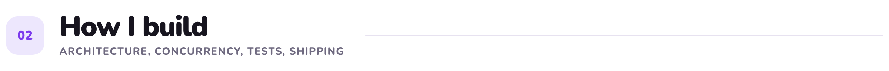
</picture>

<picture>
  <source media="(prefers-color-scheme: dark)" srcset="assets/principles-dark.png">
  
</picture>

<p align="center"><sub>Plus one that doesn't fit on a card: I pair with Claude Code daily, with architecture rules and a per-package <code>CLAUDE.md</code> so it stays useful instead of noisy.</sub></p>

<br>

<picture>
  <source media="(prefers-color-scheme: dark)" srcset="assets/section-work-dark.png">
  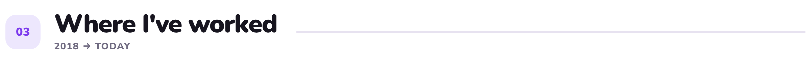
</picture>

<picture>
  <source media="(prefers-color-scheme: dark)" srcset="assets/work-dark.png">
  
</picture>

<picture>
  <source media="(prefers-color-scheme: dark)" srcset="assets/stats-dark.png">
  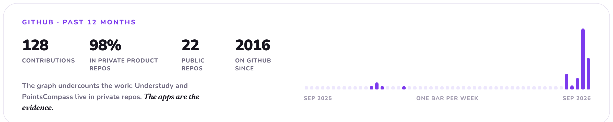
</picture>

<br>

<picture>
  <source media="(prefers-color-scheme: dark)" srcset="assets/section-beyond-dark.png">
  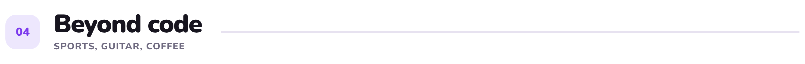
</picture>

<picture>
  <source media="(prefers-color-scheme: dark)" srcset="assets/beyond-dark.png">
  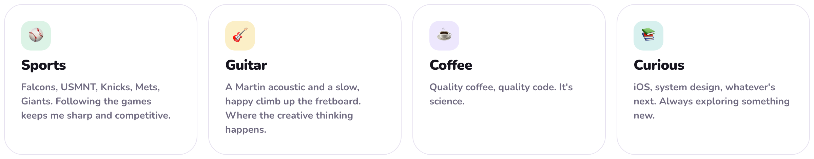
</picture>

<br>

<picture>
  <source media="(prefers-color-scheme: dark)" srcset="assets/section-connect-dark.png">
  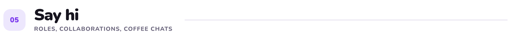
</picture>

<p align="center">Open to <b>iOS engineering roles</b>, <b>SwiftUI collaborations</b>, and <b>coffee chats</b> about shipping indie apps.</p>

<p align="center">
  <a href="mailto:reh9019@gmail.com"><picture><source media="(prefers-color-scheme: dark)" srcset="assets/link-email-dark.png"></picture></a>
  <a href="https://www.linkedin.com/in/robertoefrainhernandez"><picture><source media="(prefers-color-scheme: dark)" srcset="assets/link-linkedin-dark.png"></picture></a>
  <a href="https://www.robertoefrainhernandez.com"><picture><source media="(prefers-color-scheme: dark)" srcset="assets/link-portfolio-dark.png"></picture></a>
  <a href="https://twitter.com/PreachOnBerto"><picture><source media="(prefers-color-scheme: dark)" srcset="assets/link-x-dark.png"></picture></a>
</p>

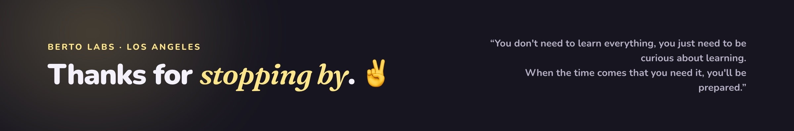
